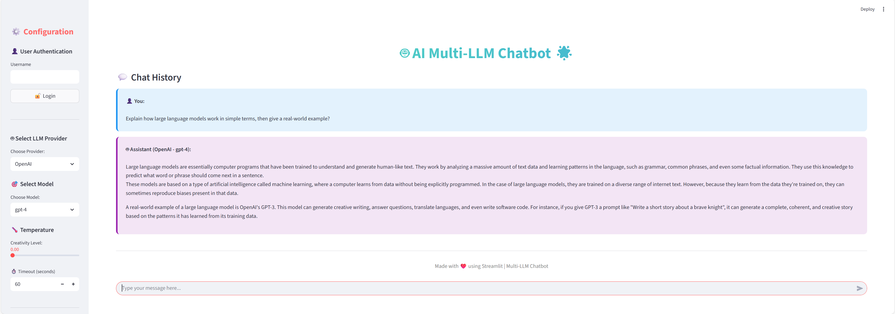
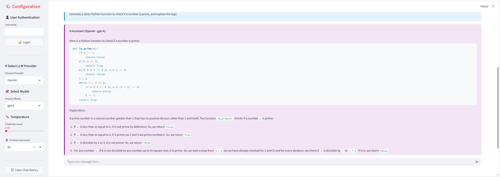

# 🤖 AI Multi-LLM Chatbot 🌟

A beautiful, interactive chatbot application that seamlessly integrates multiple Large Language Model (LLM) providers - OpenAI, Anthropic, and Ollama - with a stunning Streamlit frontend.




## ✨ Features

- 🎨 **Beautiful Gradient UI** - Eye-catching colorful interface with smooth animations
- 🤖 **Multiple LLM Providers** - Switch between OpenAI, Anthropic, and Ollama
- 🎯 **Flexible Model Selection** - Choose from various models for each provider
- 🌡️ **Temperature Control** - Adjust creativity levels from 0.0 to 2.0
- 💬 **Chat History** - View your entire conversation history
- 👤 **Optional Login** - Use with or without authentication
- 🤔 **Thinking Indicator** - Animated icon shows when AI is processing
- 🗑️ **Clear History** - Reset your conversation anytime

## 🚀 Quick Start

### Prerequisites

- Python 3.10 or higher
- (Optional) Ollama installed for local models
- (Optional) API keys for OpenAI and Anthropic

### Installation

1. **Clone the repository**
   ```bash
   git clone <your-repo-url>
   cd ai-milti-llm-chatbot
   ```

2. **Create a virtual environment**
   ```bash
   python -m venv .venv
   source .venv/bin/activate  # On Windows: .venv\Scripts\activate
   ```

3. **Install dependencies**
   ```bash
   pip install -r requirements.txt
   ```

4. **Set up environment variables**
   
   Copy the example file:
   ```bash
   cp .env.example .env
   ```
   
   Edit `.env` and add your API keys:
   ```env
   # OpenAI API Key (Required for OpenAI models)
   OPENAI_API_KEY=your_openai_api_key_here
   
   # Anthropic API Key (Required for Claude models)
   ANTHROPIC_API_KEY=your_anthropic_api_key_here
   
   # HuggingFace API Token (Optional)
   HUGGINGFACEHUB_API_TOKEN=your_huggingface_token_here
   ```

5. **Install Ollama (for local models - FREE!)**
   
   Download from [ollama.ai](https://ollama.ai) and pull models:
   ```bash
   ollama pull gemma:2b
   ollama pull tinyllama:latest
   ```

### Running the Application

Start the chatbot:
```bash
streamlit run main.py
```

The app will open in your browser at `http://localhost:8501`

## 📖 Usage Guide

### Selecting an LLM Provider

1. **OpenAI** - Requires paid API key
   - Models: GPT-4, GPT-4 Turbo, GPT-3.5 Turbo
   
2. **Anthropic** - Requires paid API key
   - Models: Claude 3.5 Sonnet, Claude 3 Opus, Claude 3 Sonnet
   
3. **Ollama** - FREE! Runs locally
   - Models: gemma:2b, tinyllama:latest

### Configuring Your Chat

1. **Choose Provider** - Select from the dropdown in the sidebar
2. **Select Model** - Pick a specific model for that provider
3. **Adjust Temperature** - Set creativity level (0.0 = focused, 2.0 = creative)
4. **Set Timeout** - Configure request timeout (default: 60 seconds)

### Optional Login

- Click "Login" in the sidebar to personalize your experience
- Or skip login and start chatting immediately!

## 🏗️ Project Structure

```
ai-milti-llm-chatbot/
├── main.py                  # Streamlit frontend application
├── requirements.txt         # Python dependencies
├── .env.example            # Environment variables template
├── .env                    # Your API keys (not in repo)
├── README.md               # This file
├── models/
│   ├── llm_openai.py       # OpenAI integration
│   ├── llm_anthropic.py    # Anthropic integration
│   ├── llm_ollama.py       # Ollama integration
│   └── llm_huggingface.py  # HuggingFace integration
└── pics/
    ├── 01.png              # Frontend screenshot
    └── 02.png              # Chat example screenshot
```

## 🔧 Configuration

### Model Options

**OpenAI Models:**
- `gpt-4` - Most capable model
- `gpt-4-turbo` - Faster GPT-4
- `gpt-3.5-turbo` - Fast and efficient

**Anthropic Models:**
- `claude-3-5-sonnet-20241022` - Latest Sonnet
- `claude-3-opus-20240229` - Most capable Claude
- `claude-3-sonnet-20240229` - Balanced performance

**Ollama Models (Local & Free):**
- `gemma:2b` - Google's lightweight model
- `tinyllama:latest` - Ultra-fast small model

### Temperature Settings

- **0.0** - Deterministic, focused responses
- **0.5** - Balanced creativity and consistency
- **1.0** - More creative and varied
- **2.0** - Maximum creativity and randomness

## 💡 Tips

- **Start with Ollama** - It's free and runs locally!
- **Low temperature** - Use for factual questions and coding
- **High temperature** - Use for creative writing and brainstorming
- **Clear history** - Reset the conversation for a fresh start
- **Timeout** - Increase for complex queries that need more processing time

## 🐛 Troubleshooting

### "Error: OPENAI_API_KEY is not set"
- Make sure you've created a `.env` file with your API keys
- Check that the key is valid and not expired

### "Error: Invalid input type"
- This was fixed in the latest version - make sure you have the updated `main.py`

### Ollama Connection Error
- Ensure Ollama is running: `ollama serve`
- Verify models are pulled: `ollama list`
- Pull missing models: `ollama pull gemma:2b`

### PyTorch/TensorFlow Warning
- This warning is harmless and can be ignored
- It appears because `transformers` library is installed but models aren't used

## 🛠️ Technology Stack

- **Frontend:** Streamlit
- **LLM Integrations:** LangChain
- **API Clients:** OpenAI, Anthropic, Ollama
- **Environment:** Python-dotenv

## 📝 License

This project is open source and available under the MIT License.

## 🤝 Contributing

Contributions, issues, and feature requests are welcome!

## 👨‍💻 Author

Built with ❤️ using Streamlit and LangChain

---

**Enjoy chatting with multiple AI models! 🚀**
